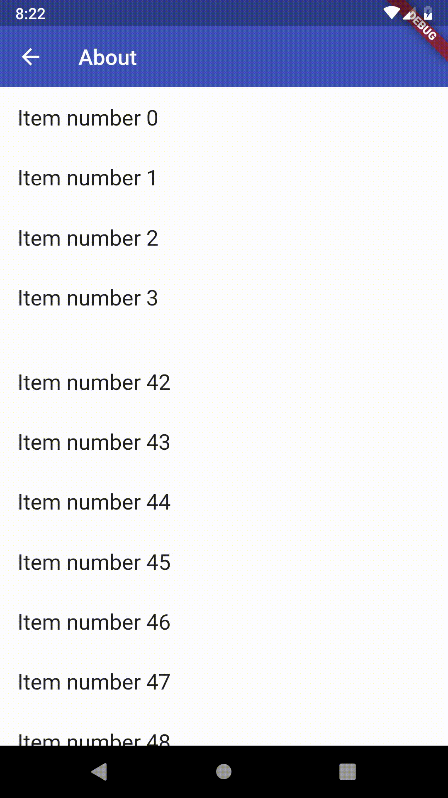
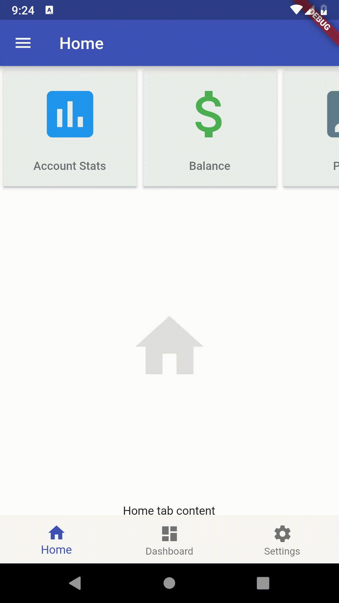

# POC Executive summary
**Goods:**
- Flutter natively supports rich UI design with smooth animations
- Architecture is reactive (not digest cycle based), so very fast
- All styling are pure scripts. All code are testable code.
- Plugins developement is straight forward. Write your native code in android studio or Xcode IDE. In Flutter just cosume the native api and render it in UI. So literally it supports any native code.
- Strong community support. During implementation, we found all the solutions what I was looking for. Lot of samples, tutorials, community blogs, stack overflow posts.
- Easy learning curve compared to Angular. No fancy architecture and keywords. Very straight forward like ReactNative.
- Supports Hot reloading. Any code change reflects in devices immediately maintaining app's states.
- Flutter provides all bells and whistles to create rich UI apps from end to end (POC to release). Very less 3rd party dependency.
- Typesafe: Dart language is just like javascript. Typesafety is like Java. So it is very easy to learn, and code is less error prone.

**Bads:**
- Code becomes clumsy very easily. To avoid clumsiness, need to create lot of sub-widgets (components).
- No code sharing with web projects. However they are developing web version of flutter named "__Hummingbird__" which will be in future. If it is available then code sharing will be possible. https://medium.com/flutter-io/hummingbird-building-flutter-for-the-web-e687c2a023a8

# Overall Verdict:
- If you need code sharing with web, flutter is not good choice.
- If web app code sharing is not required, and you want fast, feature-rich smooth gesture & animation supported native app, flutter is very good choice. Infact, it is the framework to stay for long term. Community welcomed it very well.

# Implemented Features:
## Rich User interface
- Creating Rich UI in flutter is easy and less error prone compared to CSS.   
- Flutter has no CSS. All stylings are done by Dart classes. That means all of your style code is easily testable. You see in UI based on what inside your code, which in CSS sometimes very hard to control due to inheritance.   

## Drawer:
   - Swipeable drawer from screen left edge towards right.  
   - Implementation was easy as flutter natively supports it.   
    

## App Bar or Top Nav bar - With variants
- **Variant1**- Sticky top nav bar   
    
- **Variant2**- Sticky navbar based on scroll direction allowing more content      
    
- **Variant3**- Animated parallax navbar with banner and sticky subheader (ex. tab)   
    
- Implementation was easy with support of flutter docs and community blogs

## Swipeable Bottom Nav bar with slide animation
- Slide animation on tap gesture
- Swipeable tabs   
    
- Implementation was easy as flutter natively supports it.   

## Responsive Grid Content
- Layout update based on orientation detection. On portrait mode 2 column grid and On landscape mode 4 column grid
- Implementation was easy with support of flutter docs and community blogs

## Plugins Development
- Plugins development is straight forward. Write your native code in android studio or Xcode IDE. In Flutter just consume the native api and render it in UI. So literally it supports any native code.   

## Sticky Header
- Sticky header
- On keyboard sticky headers remain in place. No jumping found. Very smooth animations.   
    
- Implemented using flutter package "flutter_sticky_header". There are multiple package available developed by community. We can developed ourselves also if needed. https://pub.dartlang.org/packages?q=flutter_sticky_header

## Scroll less Horizontal Nav with swipe animation
- Implementation was easy as flutter natively supports it.   

## Toast or animated notification
- Implementation was easy as flutter natively supports it.   

## Swipe able action from list
- Implemented with support of flutter docs and community blogs   

## On keyboard open, keep chat message input box sticky bottom
- Smooth scrolling
- Many implementation algorithm is available
- Implementation was easy with support of flutter docs, community blogs & Stackoverflow   

# TODOS:
- 3rd Party Plugins
- Custom animation
- Modal navigation
- Bottom sheet
- Mapview (OpenGL)